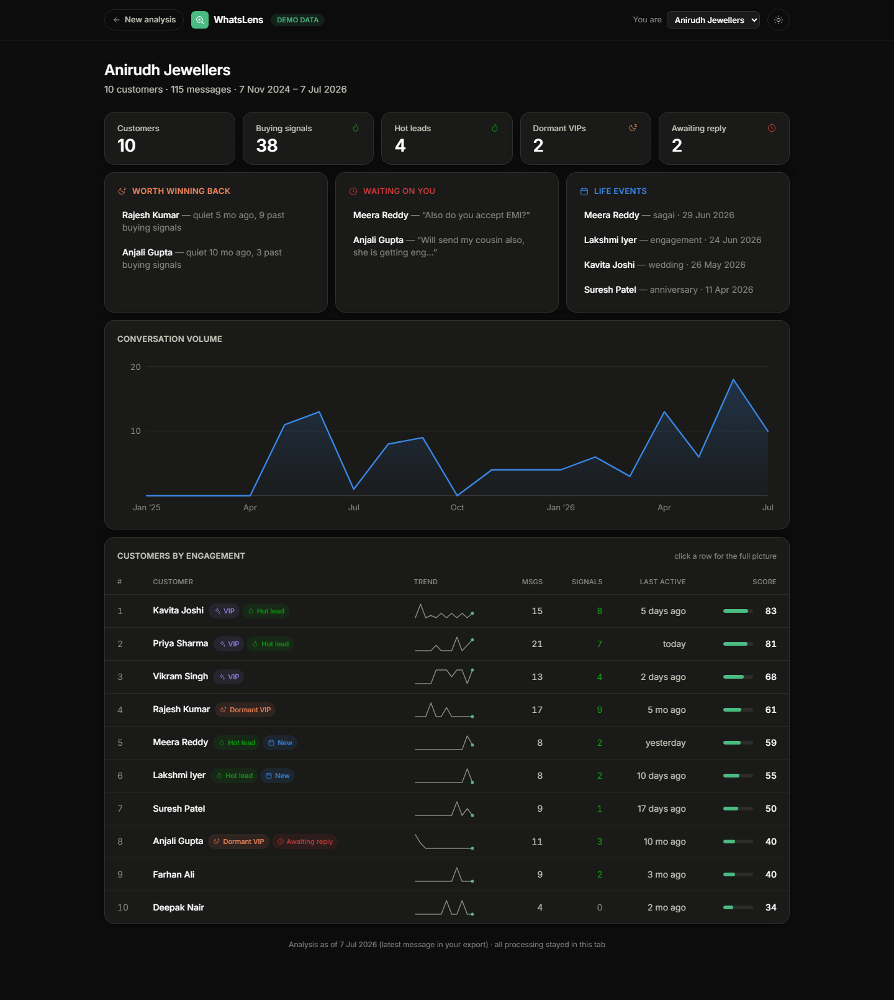

<div align="center">

# WhatsLens

**Your WhatsApp already knows your best customers.**

Drop your chat exports. See your VIPs, dormant customers, hot leads and upcoming
life events — 100% in your browser. Nothing is uploaded, ever.

</div>



## The problem nobody notices

If you run a small business in India — a jewellery shop, a boutique, a clinic,
a dealership — your entire customer relationship lives in WhatsApp. Years of
conversations: every customer, their taste, their budget, their daughter's
wedding date, their haggling style, their repeat purchases.

That chat history **is** your CRM. But it's unsearchable, unanalyzed, and one
lost phone away from gone. Nobody notices, because chat feels like
conversation — not like an asset.

The pain only ever shows up in disguise:

- *"Sales are slow this month"* — while two of your biggest past buyers have
  been quiet for six months and nobody noticed.
- *"That customer went to a competitor"* — because her question about EMI sat
  unanswered for five days.
- *"We missed the wedding order"* — even though she told you about the wedding
  in March, in writing.

WhatsLens makes the invisible visible. Export a few chats, drop them in, and
your WhatsApp tells you what it's been trying to tell you all along.

## What it finds

| Signal | What it means |
| --- | --- |
| 🌙 **Dormant VIPs** | High-value customers who went quiet. Each one is a win-back message away. |
| 🔥 **Hot leads** | People asking about price, stock, delivery *right now* — ranked so none slip through. |
| ⏰ **Awaiting reply** | Chats where the customer spoke last. Answer before a competitor does. |
| 📅 **Life events** | Weddings, birthdays, anniversaries mentioned in passing. Every one is a future sale. |
| 📈 **Engagement score** | Volume + buying intent + recency + who-initiates, blended into a 0–100 rank. |

Understands English and Hinglish (*"price kitna hai", "chahiye", "bhav"*), both
Android and iOS export formats, 12/24-hour clocks, and multi-line messages.

## Privacy is the feature

- **Zero upload.** Files are parsed with JavaScript in your tab. There is no
  backend, no analytics, no tracking — the production build is a static site.
- **Zero storage.** Close the tab and everything is gone.
- **Verifiable.** ~2,000 lines of TypeScript. Read it.

## Try it

```bash
git clone https://github.com/<you>/whatslens
cd whatslens
npm install
npm run dev        # http://localhost:3000
```

No chat exports handy? Click **"Explore the demo"** — a fictional jeweler with
10 customers, 115 messages and every signal type represented.

### Exporting your own chats

- **Android:** open a customer chat → ⋮ → More → **Export chat** → *Without media*
- **iPhone:** open a customer chat → contact name → **Export Chat** → *Without Media*

Drop one `.txt` (or `.zip`) per customer. The more chats you add, the sharper
the picture.

## How it works

```
.txt / .zip exports
      │
      ▼
parser.ts      — Android + iOS formats, dd/mm vs mm/dd detection,
      │           invisible-character stripping, multi-line stitching
      ▼
analytics.ts   — engagement scoring, Hinglish intent detection,
      │           dormancy & life-event detection, response-time stats
      ▼
React UI       — everything rendered locally, dark & light themes
```

Stack: Next.js 14 (static export) · TypeScript · Tailwind · hand-rolled SVG
charts · [fflate](https://github.com/101arrowz/fflate) for zip reading. No
chart library, no state library, no backend.

```bash
npm test           # parser + analytics test suite
npm run build      # static export to out/
```

## Part of the "Unnoticed" series

Five problems people have but haven't noticed, five open-source tools, five
days. WhatsLens is **1 of 5**. The rest are coming.

## License

MIT — do whatever you want with it. If it helps your business, tell someone
about theirs.
